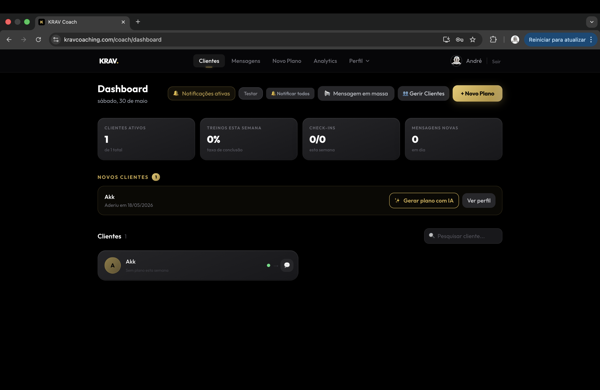
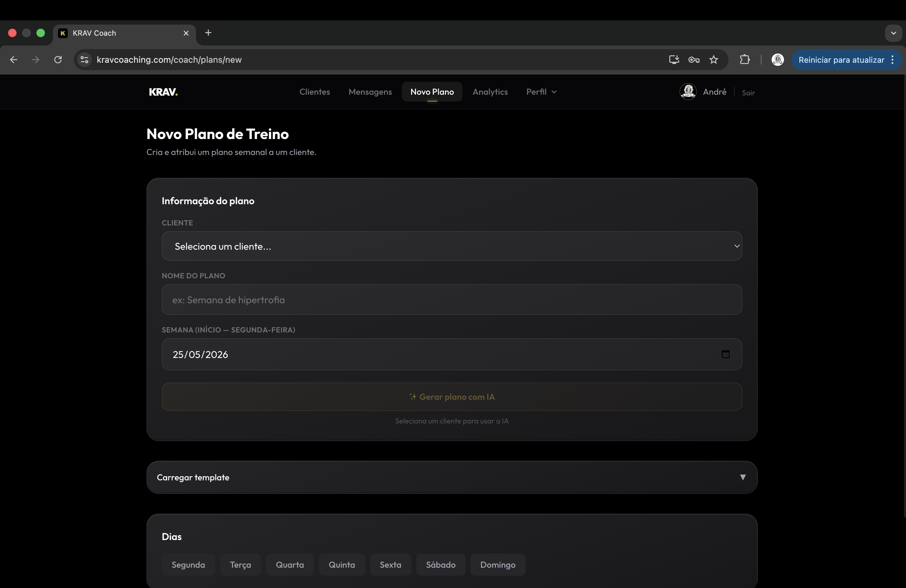
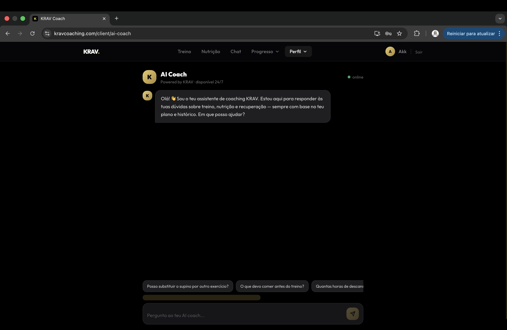
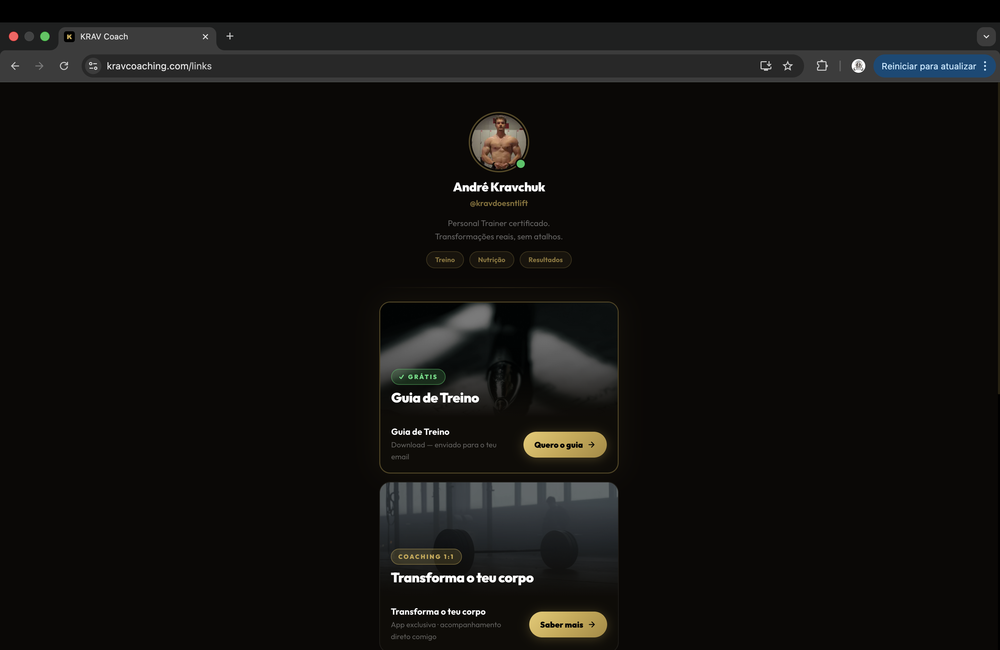

# KRAV Coach

A full coaching platform I built from scratch using Claude Code. Live at [kravcoaching.com](https://kravcoaching.com)

---

## What is it

KRAV Coach is the platform I use to run my personal training business online. Clients sign up, get a weekly training plan, track workouts, message me directly, KRAV Coach is the platform I use to run my personal training business online. Clients sign up, get a weekly training plan built by me, track workouts, and message me directly. There's also an AI assistant available for quick questions, but the coaching is done by me — someone who went through the whole transformation process alone, learned from every mistake, and built this from scratch.

Not a side project. Real app, real clients, real payments.

---

## Screenshots

### Coach Dashboard

### AI Plan Generator

### AI Coach

### Links Page

---

## Stack

Next.js 15, TypeScript, Tailwind CSS, Supabase, Stripe, Groq, Vercel, ZXing, Web Push API, Strava API

---

## What it does

On the coach side I can see all my clients, their weekly completion rates, check-ins and messages. I create training plans manually or generate them with AI based on the client profile. There's a template system so I don't have to rebuild plans from scratch every week. Mass notifications, analytics, lead management with status tracking.

On the client side they get their weekly plan, can track each exercise, log nutrition, upload progress photos, chat with me directly, and use the AI coach whenever they need. It installs as a PWA so it feels like a native app on their phone.

Payments go through Stripe. Everything is protected with row level security on Supabase. Push notifications work on mobile. There's even a barcode scanner for food logging.

---

## Numbers

47 pages, 33 API routes, 126 commits, 122 production deployments. Built in about 3 weeks.

---

## Me

André Kravchuk, certified PT and developer based in Portugal.

[kravcoaching.com](https://kravcoaching.com) · [@kravdoesntlift](https://www.tiktok.com/@kravdoesntlift) · [LinkedIn](https://linkedin.com/in/andrekravchuk)
